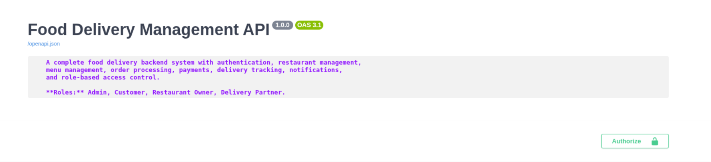
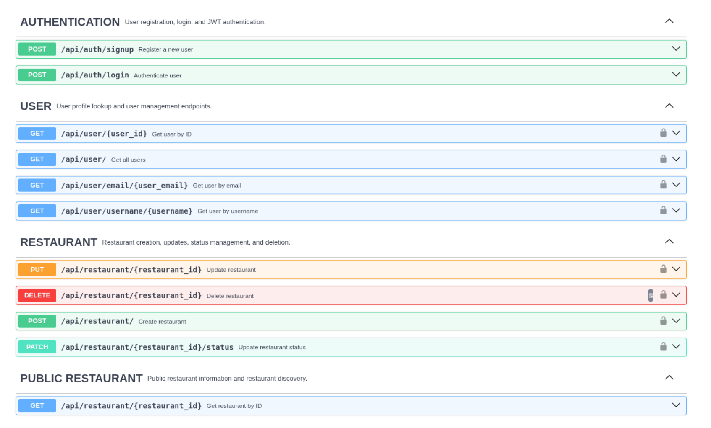
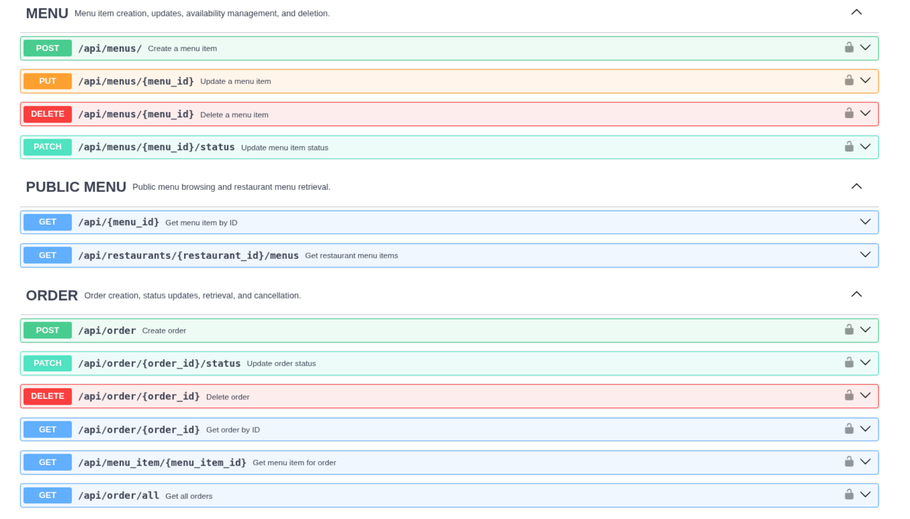
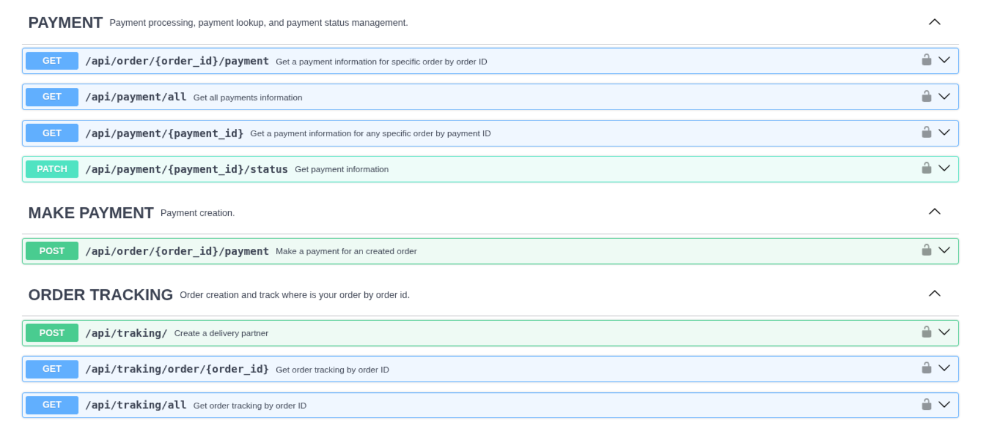
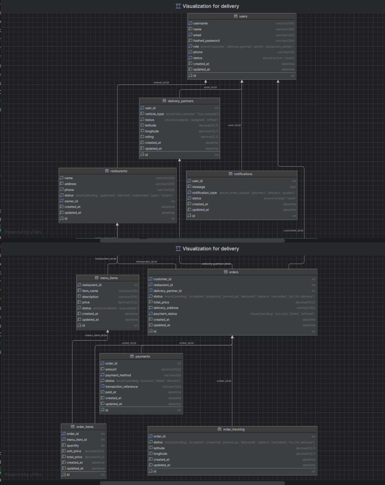

# Food Delivery Management System

A production-oriented food delivery backend built with FastAPI, SQLAlchemy Async ORM, MySQL, JWT authentication, role-based access control, Docker, and a service-layer architecture.

The system supports restaurant management, menu management, order processing, payments, delivery partner management, notifications, and order tracking.


## Highlights

- Async FastAPI architecture
- JWT Authentication & RBAC
- SQLAlchemy 2.0 Async ORM
- Redis caching
- MySQL
- Docker & Docker Compose
- Service Layer architecture
- OpenAPI documentation

## Screenshots

### Swagger UI










### Database Diagram



## Features

*  JWT Authentication
*  Role-Based Access Control
*  Async FastAPI + Async SQLAlchemy
*  Dockerized Backend & Frontend
*  Shared MySQL & Redis Infrastructure
*  Redis Caching
*  Admin Management
*  Health Monitoring Endpoint
*  Rate Limiting using SlowAPI

### Teach Stack

| Layer            | Technology              |
| ---------------- | ----------------------- |
| Backend          | FastAPI                 |
| Database         | MySQL                   |
| Cache            | Redis                   |
| ORM              | SQLAlchemy 2.x Async    |
| Async Driver     | aiomysql                |
| Frontend         | React + Vite            |
| Authentication   | JWT                     |
| Password Hashing | bcrypt + passlib        |
| Authorization    | RBAC                    |
| Server           | Uvicorn / Gunicorn      |
| Containerization | Docker + Docker Compose |


---

## Project Structure

```text
.
├── backend/
│   ├── app/
│   │   ├── api/
│   │   │   └── routes/                     # FastAPI route modules
│   │   ├── core/                           # Config, security, constants, logging, exceptions
│   │   ├── db/                             # Async database session 
│   │   │   └── models/                     # SQLAlchemy models
│   │   ├── repositories/                   # Repository layer placeholders
│   │   ├── schemas/                        # Pydantic request/response schemas
│   │   ├── services/                       # Business logic modules
│   │   ├── tasks/                          # Background task placeholders
│   │   ├── tests/                          # Test placeholders
│   │   ├── websocket/                      # Realtime event and handler placeholders
│   │   │
│   │   ├── lifespan.py
│   │   └── main.py
│   │
│   ├──.env.example
│   └── requirements.txt
│
├── db_queries/                             # Database setup tables creation and permissions 
├── docker/                                 # Dockerfiles   
├── docs/                                   # Documentaion about project 
├── frontend/                               # Frontend
├── images/                                 # Image about project 
├── k6/                                     # Load test
├── nginx/                                  # Nginx placeholder
├── scripts/                                # Utility script
│
├── docker-compose.oss.yml                  # Whole project Container
├── docker-compose.yml                      # Api Container
├── LICENSE
├── progress.md
└── README.md
```
---


## Quick Start

```text
Installation
├── Clone repository
├── Configure .env
├── Install dependencies
├── Run database
├── Run backend
└── Run frontend
```
```bash
git clone https://github.com/Dhruv-Cmds/Delivery-System.git

cd Delivery-System
```
## Configure .env

```
cp .env.example .env
```

## Create Virtual Environment

```bash
python -m venv .venv
```

### Windows

```bash
.venv\Scripts\activate
```

### Linux / macOS

```bash
source .venv/bin/activate
```

## Install Dependencies

```bash
pip install -r requirements.txt
```

## Run Backend

```bash
uvicorn app.main:app --reload --port 8000
```

# 🔐 Authentication

Protected routes require:

```text
Authorization: Bearer <your_token>
```

## JWT Authentication Exa

```bash
curl -X POST http://127.0.0.1:8003/api/login \
  -H "Content-Type: application/json" \
  -d '{"username":"admin","password":"admin123"}'
```

```bash
curl http://127.0.0.1:8003/api/order \
  -H "Authorization: Bearer <ACCESS_TOKEN>"
```

## API Documentation

Swagger Docs:

```text
http://127.0.0.1:8003/docs
```

ReDoc:

```text
http://127.0.0.1:8003/redoc
```

---

# Documentation

Detailed documentation is available in the `docs/` directory.

| Document | Description |
|----------|-------------|
| [Architecture](docs/architecture.md) | System architecture, service layers, domain model, and core modules. |
| [Docker](docs/docker.md) | Docker workflows, shared infrastructure, and local development. |
<!-- | [Deployment](docs/deployment.md) | VPS deployment, CI/CD pipeline, and production infrastructure. | -->
| [Security](docs/security.md) | Authentication, authorization, validation, and production security. |
<!-- | [Testing](docs/testing.md) | Test environment, async testing, Docker testing, and CI. |
| [Load Testing](docs/load-testing.md) | Benchmark methodology and load testing results. |
| [Performance](docs/performance.md) | Performance analysis, bottlenecks, scalability, and future improvements. | -->

## License

This project is intended for educational and portfolio purposes.

See LICENSE for details.the [LICENSE](LICENSE) file for details.
